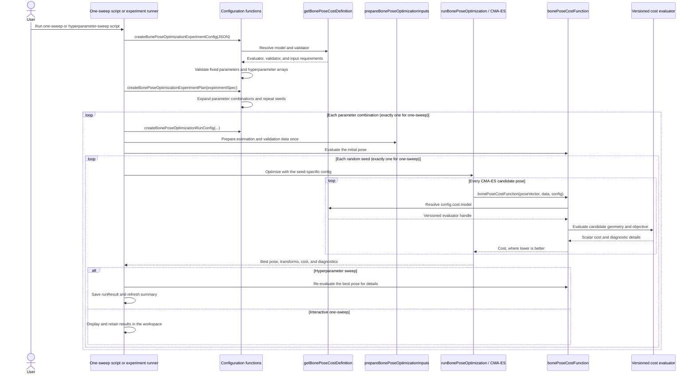

# Optimization-Based Bone Registration with B-Mode Ultrasound

## Short summary

This MATLAB project supports the development of optimization-based bone registration using tracked B-mode ultrasound images. Its purpose is to explore how much information conventional B-mode ultrasound can provide for estimating the three-dimensional pose of a bone when a CT-derived bone mesh and an approximate initial registration are available.

For each candidate bone pose, the pipeline places the CT mesh in the experiment reference frame, intersects the mesh with the tracked ultrasound image planes, and keeps intersection segments whose mesh surfaces face the probe. The cost function then evaluates the brightness and coverage of the corresponding ultrasound pixels. A bounded CMA-ES optimizer searches for a six-degree-of-freedom correction to the coarse bone pose.

The project currently provides two entry points:

- `main_bonePoseOptimization_oneSweep.m` runs one interactive configuration and displays the initial and optimized geometry. Use this first when checking a new dataset or cost-function change.
- `main_bonePoseOptimization_hyperparamSweep.m` runs every configured cost-parameter combination for every configured random seed and saves an analysis-ready experiment summary.

This repository is research and development code. The cost function, optimization settings, and validation strategy are expected to evolve while the capabilities and limitations of B-mode ultrasound for bone registration are investigated.

## Experiment setup

The workflow was developed for a knee phantom, but the same general arrangement can be used with a cadaver leg. The physical setup must connect the CT anatomy, tracked bone pins, ultrasound probe, and motion-capture reference frame without changing their geometry between calibration, CT imaging, and ultrasound acquisition.

### 1. Equip the specimen with tracked bone pins

Attach a bone pin to each bone that will be registered, such as the femur or tibia. Each pin carries an optical-marker rigid body so the bone pose can be measured by the motion-capture system. The pin must remain rigidly attached to the bone throughout CT scanning and ultrasound acquisition.

Also provide a fixed reference rigid body in the experimental workspace. This reference defines the common coordinate frame in which the tracked ultrasound images, bone-pin measurements, CT meshes, coarse estimates, and final optimization results are compared.

### 2. Acquire the CT scan before the ultrasound experiment

CT-scan the knee phantom or cadaver leg together with the attached bone pins and their optical-marker geometry. The CT scan must contain enough information to reconstruct:

- The surface mesh of each bone.
- The anatomical coordinate system of each bone.
- The CT-side coordinate system of each bone pin.
- The optical-marker geometry needed to relate the physical tracked pin to the corresponding CT geometry.

Keeping the pin and marker assembly unchanged is essential. Reattaching or moving a pin after the CT scan breaks the rigid relationship used to obtain the ground-truth bone pose.

### 3. Process the CT anatomy and tracking geometry

Segment or prepare the bone meshes, define their anatomical coordinate systems, and identify the pin-marker geometry in the CT data. The tools in [`tools/`](tools/README.md) describe the expected processing order and output structures.

The processed CT result connects the CT mesh to the tracked bone pin. During the ultrasound experiment, this relationship allows the measured pin pose to place the complete CT bone mesh in the common reference frame.

### 4. Place the specimen in the motion-capture workspace

Place the instrumented knee under the working volume of an optical motion-capture system. This project is being developed with a Qualisys system. Confirm that the reference object, bone-pin rigid bodies, and probe rigid body are simultaneously visible and use consistent rigid-body names.

Before collecting ultrasound data, check the marker definitions, axis directions, units, and coordinate-system handedness. These definitions must agree with those used during CT processing. A mismatch can create a plausible-looking but incorrect bone registration.

### 5. Track and calibrate the ultrasound probe

Attach an optical-marker rigid body to the B-mode ultrasound probe. Calibrate the relationship between the image and probe coordinate systems beforehand. This workflow uses the [PLUS Toolkit](https://plustoolkit.github.io/) and expects an fCal/PLUS calibration containing the `ImageToProbe` transform.

The calibration connects an ultrasound pixel to a physical location relative to the tracked probe. Together with the measured probe and reference poses, it allows each B-mode image to be represented as a finite plane in the common three-dimensional reference frame.

### 6. Acquire tracked B-mode ultrasound snapshots

Move the tracked probe over the bone surface and record B-mode ultrasound snapshots. Save the ultrasound image data together with the corresponding probe, reference, and bone-pin tracking measurements. The acquisition software used for this work is maintained in the separate [BmodeMocapIntegration repository](https://github.com/dacvm/BmodeMocapIntegration).

Each accepted snapshot ultimately provides:

- A B-mode image.
- A calibrated image plane in three-dimensional reference coordinates.
- A timestamp and source record that connect the image to its tracking data.

### 7. Build the estimation and ground-truth data

The tracked and calibrated probe provides the estimated position of each ultrasound image in 3D space. The CT mesh and the optically tracked bone pin provide an independent ground-truth bone pose. These two information paths serve different purposes:

- The optimizer receives the CT mesh, tracked ultrasound planes, image intensities, and a coarse initial pose.
- The ground-truth bone pose and ground-truth intersections are kept separate and are used only for validation after estimation.

This separation prevents the optimization cost from using the answer that it is intended to estimate.

## Required input data

Raw B-mode ultrasound and motion-capture data can be recorded with the acquisition software in [BmodeMocapIntegration](https://github.com/dacvm/BmodeMocapIntegration). Before running the optimizer, follow the instructions in [`tools/README.md`](tools/README.md) and the README inside each relevant tool directory. The preparation tools are generally used in this order:

1. [`tools/ctkneePostProcess/`](tools/ctkneePostProcess/README.md) prepares the CT bone meshes, anatomical frames, and bone-pin geometry.
2. [`tools/ultrasoundSpatialProcessing/`](tools/ultrasoundSpatialProcessing/README.md) combines ultrasound snapshots, PLUS calibration, Qualisys tracking, and CT data; it also supports review and export of accepted snapshots.
3. [`tools/boneSegmentationProcess/`](tools/boneSegmentationProcess/README.md) extracts candidate bone-surface responses from the selected ultrasound images.
4. [`tools/bonePreRegistration/`](tools/bonePreRegistration/README.md) estimates the coarse CT-to-reference pose used as the center of the optimization search.

The optimization configuration points to three required MAT files and one optional bone-surface file:

| Configuration field | High-level purpose |
| --- | --- |
| `validSnapshotsMatFile` | MAT file exported by the ultrasound spatial-processing review. It contains accepted, tracked B-mode image planes and separate ground-truth bone poses and intersections. The optimizer uses the image planes but does not use the ground-truth intersections in its cost. |
| `boneSurfaceMatFile` | Optional MAT file produced by bone-surface extraction and 3D recovery. Input preparation aligns its 2D and 3D measurements with the selected ultrasound snapshots. A cost model only requires this file when its definition sets `requiresBoneSurface` to `true`. |
| `ctPostProcessedMatFile` | MAT file produced by CT knee post-processing. It contains the CT bone meshes, anatomical coordinate systems, and the rigid relationship between each bone and its selected pin. |
| `coarseRegistrationMatFile` | MAT file produced by bone pre-registration. It contains the approximate CT-to-reference transform that initializes the optimizer and the matching coarse bone mesh in the reference frame. |

The prepared files must describe the same specimen, bone, pin selection, marker geometry, units, and coordinate-frame conventions. The `input.bone` setting selects the target bone code, such as `F` for femur or `T` for tibia.

### Optimization code organization

The three stable workflow entry points remain directly under
`functions/bonePoseOptimization/`: cost evaluation, one optimization run, and
one experiment run. Supporting functions are grouped one level below:

- `configuration/` reads JSON and builds experiment and scalar run settings.
- `costModels/` contains model registration, versioned cost functions, and validators.
- `inputPreparation/` loads and prepares reusable optimization inputs.
- `poseEvaluation/` converts optimizer states and evaluates candidate-pose geometry.
- `evaluationMetric/` and `evaluationPlot/` analyze saved results.
- `tests/` test codes that verifies the active pipeline.

### Optimizer parameters

The optimizer represents a candidate as a local six-value perturbation `[vx; vy; vz; wx; wy; wz]` around the coarse CT-to-reference transform. Translation is expressed in the mesh length unit, normally millimetres, and rotation is configured in degrees before conversion to radians.

| Setting | Meaning |
| --- | --- |
| `translationBoundMm` | Symmetric translation limit for each of the three translation components. |
| `rotationBoundDeg` | Symmetric rotation-vector limit for each of the three rotation components. |
| `translationSigmaMm` | Initial CMA-ES search spread for the translation components. |
| `rotationSigmaDeg` | Initial CMA-ES search spread for the rotation components. |
| `populationSize` | Number of CMA-ES candidate solutions evaluated in a population. |
| `maxFunctionEvaluations` | Function-evaluation budget for each optimization run. |
| `useParfor` | Requests parallel candidate evaluation when the Parallel Computing Toolbox and a valid license are available. |
| `parforWorkers` | Worker limit passed to the bundled parallel CMA-ES implementation. |

The `experiment.seeds` array controls repeated stochastic runs. A one-sweep configuration must contain exactly one parameter combination and one seed. The sweep configuration can contain several values and seeds.

## Supported cost functions

This is an ongoing list. The current framework registers the following three versioned cost models; more models can be added through the extension process described in [Processing workflow](#processing-workflow). Every model returns one scalar objective to CMA-ES, and a lower value is always better.

In the tables below, a **fixed parameter** has one value for the complete experiment. A **hyperparameter** is an array of candidate values; the experiment planner includes it in the Cartesian product used to create parameter combinations.

### `intensityCov_v1`: intensity and coverage

This model intersects the candidate CT mesh with each tracked ultrasound plane and keeps pixels produced by probe-facing mesh faces. It rewards intersections that are both bright and sufficiently covered relative to the intersection at the coarse initial pose. It also penalizes active image planes whose candidate intersection contains too few pixels. This prevents a very small but bright intersection from appearing better than a physically meaningful one.

For every active plane, the score is the normalized mean pixel intensity multiplied by its capped coverage ratio. The final cost is the negative mean score plus the weighted fraction of missing planes.

| Parameter | Type | Meaning |
| --- | --- | --- |
| `intensityMax` | Fixed | Positive intensity used to normalize the mean sampled brightness, normally `255` for 8-bit images. |
| `minReferencePixels` | Hyperparameter | Positive minimum intersection-pixel count at the initial pose. A plane below this threshold is inactive and does not contribute to the cost. |
| `nMinPixels` | Hyperparameter | Positive minimum pixel count required at the current candidate pose. An active plane below this threshold is marked as missing. |
| `lambdaMissing` | Hyperparameter | Nonnegative multiplier applied to the fraction of active planes marked as missing. `0` disables this penalty. |

This model does not require `boneSurfaceMatFile`.

### `ICPLike_v1`: one-way 3D point-to-mesh distance

This model transforms the CT mesh to the candidate pose and measures the distance from every ultrasound-derived 3D bone-surface point to its closest location on the mesh triangles. The returned cost is the root-mean-square of all point-to-surface distances in millimetres. It is one-way: measured ultrasound points must agree with the mesh, but unobserved regions of the mesh do not require corresponding ultrasound points.

| Parameter | Type | Meaning |
| --- | --- | --- |
| `nearestVertexCount` | Fixed | Positive integer number of nearby mesh vertices used to seed the local candidate-triangle search for each measured 3D point. A larger value searches a wider mesh neighborhood but increases evaluation time. |

This model requires aligned 3D bone-surface measurements from `boneSurfaceMatFile`.

### `intensityICP_v1`: combined intensity and 3D distance

This model evaluates both models above at the same candidate pose. It divides the point-to-mesh RMSE by a reference distance to make that term dimensionless, then returns the convex blend

```text
cost = weight * intensityCoverageCost
     + (1 - weight) * (pointCloudRmseMm / distanceReferenceMm)
```

A `weight` of `1` selects only the intensity-and-coverage term, while `0` selects only the normalized point-to-mesh term.

| Parameter | Type | Meaning |
| --- | --- | --- |
| `intensityMax` | Fixed | Positive intensity used to normalize the mean sampled brightness, normally `255` for 8-bit images. |
| `nearestVertexCount` | Fixed | Positive integer number of nearby mesh vertices used to seed the local candidate-triangle search for each measured 3D point. A larger value searches a wider mesh neighborhood but increases evaluation time. |
| `distanceReferenceMm` | Fixed | Positive distance in millimetres used to normalize the point-to-mesh RMSE before it is combined with the dimensionless intensity term. |
| `minReferencePixels` | Hyperparameter | Positive minimum intersection-pixel count at the initial pose. A plane below this threshold is inactive and does not contribute to the cost. |
| `nMinPixels` | Hyperparameter | Positive minimum pixel count required at the current candidate pose. An active plane below this threshold is marked as missing. |
| `lambdaMissing` | Hyperparameter | Nonnegative multiplier applied to the fraction of active planes marked as missing. `0` disables this penalty. |
| `weight` | Hyperparameter | Convex blend coefficient in the inclusive range `[0, 1]`; it weights the intensity term, while `1 - weight` weights the normalized 3D-distance term. |

This model requires aligned 3D bone-surface measurements from `boneSurfaceMatFile`.

## Running the project

### Requirements

- MATLAB with support for `triangulation`, tables, JSON decoding, and the functions used by the preparation tools.
- Parallel Computing Toolbox is optional. When it is unavailable, a configuration requesting `useParfor` falls back to serial CMA-ES with a warning.
- Prepared input MAT files from the workflows under `tools/`.

The external CMA-ES implementation used by this project is already stored under `functions/external/`. Do not modify files in that directory when changing project-specific optimization behavior.

### 1. Configure the input paths and settings

Edit one of the following files:

- `config/optconfig_oneSweep_intensityCov.json` for an intensity-only interactive run.
- `config/optconfig_oneSweep_ICPLike.json` for an ICP-like point-cloud interactive run.
- `config/optconfig_oneSweep_intensityICP.json` for a combined interactive run after selecting it in the one-sweep script.
- `config/optconfig_hyperparamSweep_intensityCov.json` for the current unattended multi-parameter, multi-seed experiment.

The file under `config/legacy/` records the former schemaVersion02 layout for historical
reference only. Active readers do not execute schema-less legacy configs.

Set `project.root` relative to the configuration directory or provide an absolute path. The supplied configuration files use `".."`, which resolves to this repository root. Input paths are then resolved relative to that project root.

### 2. Start MATLAB in the repository root

Both main scripts build the configuration path from `pwd`. Change MATLAB's current folder to the directory containing this README before running either script:

```matlab
cd('D:/path/to/bmodeimage_3dspace')
```

### 3. Run one sweep first

```matlab
main_bonePoseOptimization_oneSweep
```

The one-sweep workflow requires exactly one hyperparameter combination and one seed. It displays the initial setup and intersections, runs CMA-ES, leaves the numeric result in the MATLAB workspace, and displays the optimized estimate alongside the separately stored validation data.

Use this workflow to confirm that:

- The intended bone and input files are selected.
- Ultrasound planes and the coarse CT mesh share the correct reference frame.
- Probe-facing intersection pixels appear in plausible image locations.
- The initial and optimized costs are finite.
- Search bounds, population size, evaluation budget, and parallel settings are practical.

### 4. Run the hyperparameter sweep

```matlab
main_bonePoseOptimization_hyperparamSweep
```

The sweep creates a new timestamped experiment on every invocation. It does not resume an older experiment. Before starting, MATLAB prints the number of combinations, seeds, planned runs, and maximum planned CMA-ES function evaluations. During execution, each completed or failed run is written to disk and the summary files are refreshed.

## Output structure

### One-sweep output

The one-sweep workflow stores raw CMA-ES files below the configured output folder. Its main `optimizationResult`, initial details, prepared data, and validation data remain in the MATLAB workspace unless the user saves them separately.

```text
output/bonePoseOptimization/oneSweeps/
+-- run_yyyyMMdd_HHmmss/
    +-- variablescmaes.mat
    +-- outcmaes*.dat
    +-- functions/optimizers/CMAES/OptData/
        +-- OptSaver.mat
```

`variablescmaes.mat` and the `outcmaes*.dat` files contain the raw optimizer state, history, and diagnostics produced by the bundled CMA-ES implementation. `OptSaver.mat` is the progress file expected by that implementation.

### Hyperparameter-sweep output

Every sweep creates a separate experiment folder. Its name combines `experiment.name` with a timestamp:

```text
output/bonePoseOptimization/experiments/
+-- <experiment-name>_yyyyMMdd_HHmmss_SSS/
    +-- experiment_config_snapshot.json
    +-- experiment_plan.mat
    +-- validation_context.mat
    +-- summary.csv
    +-- summary.mat
    +-- runs/
        +-- combination_0001/
        |   +-- seed_1001/
        |   |   +-- runResult.mat
        |   |   +-- cmaes/
        |   |       +-- run_yyyyMMdd_HHmmss/
        |   |           +-- variablescmaes.mat
        |   |           +-- outcmaes*.dat
        |   |           +-- functions/optimizers/CMAES/OptData/
        |   |               +-- OptSaver.mat
        |   +-- seed_1002/
        |       +-- ...
        +-- combination_0002/
            +-- ...
```

`validation_context.mat` is written after the first successful input preparation. It may be absent if every combination fails before validation data can be saved.

### Experiment-level files

| File | Contents |
| --- | --- |
| `experiment_config_snapshot.json` | Copy of the original JSON used to start the experiment. |
| `experiment_plan.mat` | Resolved experiment specification, complete combination and run tables, and MATLAB/parallel-environment metadata. |
| `validation_context.mat` | Ground-truth validation packet plus the shared initial CT-to-reference and bone-to-reference transforms. |
| `summary.csv` | Flat, analysis-friendly row for every planned combination-seed run. |
| `summary.mat` | MATLAB version of the same summary table with MATLAB data types preserved. |

The summary begins with every run marked `pending`. After each attempt, its row is updated with identifiers, cost-model name, scalar hyperparameters, seed, status, timestamps, runtime, initial and best costs, function-evaluation count, CMA-ES stop reason, result path, and any error information.

### Evaluation tables

`main_bonePoseOptimization_evaluation.m` loads the schema-version-4 experiment
plan together with the summary and validation context. The saved
`experimentPlan.parameterNames` list defines which summary columns are swept
parameters and keeps them in the order chosen by the cost-model validator.

The evaluation output contains one CSV row per run and one ranked CSV row per
parameter combination. Both tables retain the cost-model name and all declared
parameter columns. The MAT output also stores the schema version, cost model,
and parameter-name list in `evaluationMetadata`.

The active evaluator requires a schema-version-4 experiment plan containing
`parameterNames`. Older experiment plans that do not contain this metadata are
not inferred automatically and should be inspected with the code version that
created them.

The evaluator's `heatmapSettings` block controls one paneled heatmap figure.
`xParameter` and `yParameter` form the cells inside each heatmap, while
`panelRowParameter` and `panelColumnParameter` arrange the remaining parameter
values as rows and columns of small heatmaps. A parameter can instead be given
one value in `parametersToHold` when the figure should show only that slice.
Every swept parameter must have exactly one of these roles, which prevents a
new cost-model parameter from being hidden accidentally. To inspect a second
arrangement, copy the settings block under a new name and call
`plotHyperparameterPaneledHeatmaps` again.

### Per-run `runResult.mat`

Each seed folder contains one `runResult.mat`, including failed runs. Its top-level structure is:

```text
runResult
+-- run
|   +-- runNumber, runId
|   +-- combinationNumber, combinationId
|   +-- seed, status
|   +-- startTime, endTime, runtimeSeconds
|   +-- resultFilePath
+-- configuration
+-- initial
|   +-- poseVector
|   +-- cost
+-- optimizationResult
+-- final
|   +-- cost
|   +-- costDetails
+-- validationReference
+-- error
    +-- stage
    +-- identifier
    +-- message
    +-- stack
```

For a completed run, `optimizationResult` contains the initial and best pose vectors, initial and best rigid transforms, search bounds, sigma, raw CMA-ES outputs, seed, and optimizer output paths. `final.costDetails` contains the final candidate mesh, per-plane intersection geometry, sampled-pixel counts, brightness and coverage values, missing-plane flags, and separated cost terms.

For a failed run, the same overall shape is retained where practical, while unavailable numeric values are stored as `NaN` or empty structs. The `error` group records whether the failure occurred during preparation or optimization and preserves the MATLAB exception information.

## Processing workflow

The one-sweep and hyperparameter-sweep scripts share the same configuration, planning, input-preparation, optimizer, and cost-dispatch framework. The sweep runner adds loops over parameter combinations and random seeds, plus immediate result saving. The following sequence shows the main function calls; display-only calls in the interactive one-sweep script are omitted.



At configuration time, `createBonePoseOptimizationExperimentConfig` asks the registry for the selected model's validator. The validator separates values that stay fixed from arrays that should be swept. `createBonePoseOptimizationExperimentPlan` then builds every combination, and `createBonePoseOptimizationRunConfig` merges one combination into `config.cost.parameters`, the scalar structure seen by a cost evaluator.

At optimization time, CMA-ES changes only the six-value local pose perturbation. `bonePoseCostFunction` is the stable public dispatcher: it reads `config.cost.model`, resolves the registered evaluator, and forwards the pose, prepared data, and scalar configuration. Consequently, the optimizer and runner do not need model-specific branches.

### Adding a new cost function

1. **Create a versioned evaluator in `functions/bonePoseOptimization/costModels/`.** Use the interface `[cost, details] = cost_<name>_vNN(poseVector, data, config)`. Perform file loading and other reusable preparation before optimization, not inside this frequently called function. Return one finite numeric scalar, keep the convention that lower is better, and place useful intermediate values in `details` so a saved best pose can be inspected.

   ```matlab
   function [cost, details] = cost_example_v01(poseVector, data, config)
   %COST_EXAMPLE_V01 Evaluate one candidate pose with the example model.
   % This evaluator converts the candidate pose into one finite objective so
   % the shared CMA-ES framework can optimize a new source of evidence.
   %
   % Inputs:
   %   poseVector - Six-value perturbation around the initial CT pose.
   %   data       - Prepared inputs reused by every candidate evaluation.
   %   config     - Scalar runtime settings, including cost.parameters.
   %
   % Outputs:
   %   cost       - Finite scalar objective value; lower is better.
   %   details    - Diagnostic values needed to inspect this evaluation.

   % Convert and evaluate the candidate here using prepared data and scalar settings.
   % Replace this placeholder with the model's actual calculation.
   cost = 0;

   % Save enough context to explain the returned scalar after optimization.
   details.costSettings = config.cost.parameters;
   details.status = 'example_cost_computed';
   end
   ```

2. **Create its matching validator beside the evaluator.** Use the interface `[fixedParameters, hyperparameters] = validate_cost_<name>_vNN(fixedParameters, hyperparameters)`. Require the exact supported field names, validate every value, convert fixed values to scalar doubles, and normalize each hyperparameter candidate list to a row vector. Rebuild the output structs in the order in which their fields should appear in experiment tables. An empty struct is valid when the model has no fixed parameters or no hyperparameters.

3. **Register the model in `getBonePoseCostDefinition.m`.** Add one `switch` case that assigns the public model name, evaluator, validator, and input requirement:

   ```matlab
   case 'example_v1'
       definition.modelName                   = 'example_v1';
       definition.evaluateFcn                 = @cost_example_v01;
       definition.validateExperimentConfigFcn = @validate_cost_example_v01;
       definition.requiresBoneSurface         = false;
   ```

   Set `requiresBoneSurface` to `true` only when the evaluator needs the aligned measurements from `boneSurfaceMatFile`. If a model needs other prepared data that the framework does not yet provide, extend `prepareBonePoseOptimizationInputs` once so the data is loaded and validated before CMA-ES starts.

4. **Create or copy a schema-version-4 JSON configuration.** Set `cost.model` to the registered name. Put one scalar value per fixed parameter under `fixedParameters` and one or more candidate values per sweepable parameter under `hyperparameters`:

   ```json
   "cost": {
     "model": "example_v1",
     "fixedParameters": {
       "fixedScale": 1.0
     },
     "hyperparameters": {
       "exampleWeight": [0.25, 0.5, 0.75]
     }
   }
   ```

5. **Test the integration before running a long sweep.** Extend `functions/bonePoseOptimization/tests/testBonePoseCostDispatcher.m` to check the registry mapping and dispatcher, then run a one-sweep configuration with a small CMA-ES evaluation budget. Confirm that the initial and optimized costs are finite, the expected parameter columns appear in the plan, required inputs are enforced, and `details` explains the returned value. Once that passes, use the hyperparameter-sweep entry point without changing the optimizer or experiment runner.
