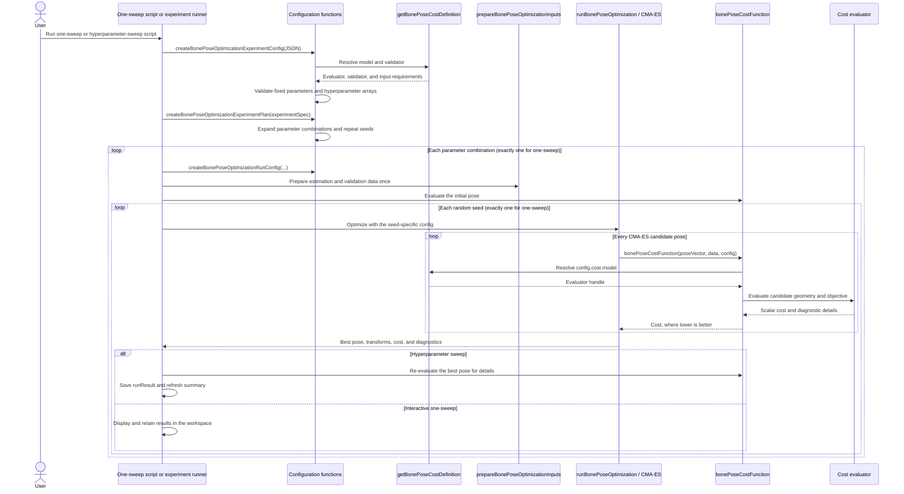

# Optimization-Based Bone Registration with B-Mode Ultrasound

## 1. Table of contents

- [1. Table of contents](#1-table-of-contents)
- [2. Short summary](#2-short-summary)
- [3. Experiment setup](#3-experiment-setup)
  - [3.1. Equip the specimen with tracked bone pins](#31-equip-the-specimen-with-tracked-bone-pins)
  - [3.2. Acquire the CT scan before the ultrasound experiment](#32-acquire-the-ct-scan-before-the-ultrasound-experiment)
  - [3.3. Process the CT anatomy and tracking geometry](#33-process-the-ct-anatomy-and-tracking-geometry)
  - [3.4. Place the specimen in the motion-capture workspace](#34-place-the-specimen-in-the-motion-capture-workspace)
  - [3.5. Track and calibrate the ultrasound probe](#35-track-and-calibrate-the-ultrasound-probe)
  - [3.6. Acquire tracked B-mode ultrasound snapshots](#36-acquire-tracked-b-mode-ultrasound-snapshots)
  - [3.7. Build the estimation and ground-truth data](#37-build-the-estimation-and-ground-truth-data)
- [4. Required input data](#4-required-input-data)
  - [4.1. Optimization code organization](#41-optimization-code-organization)
  - [4.2. Optimizer parameters](#42-optimizer-parameters)
- [5. Supported cost functions](#5-supported-cost-functions)
  - [5.1. `intensityLine`: smoothed intensity along the predicted bone](#51-intensityline-smoothed-intensity-along-the-predicted-bone)
  - [5.2. `ICPLike`: one-way 3D point-to-mesh distance](#52-icplike-one-way-3d-point-to-mesh-distance)
  - [5.3. `intensityICP`: combined intensity and 3D distance](#53-intensityicp-combined-intensity-and-3d-distance)
  - [5.4. `PIMLOP`: most-likely oriented point match](#54-pimlop-most-likely-oriented-point-match)
  - [5.5. `intensityPIMLOP`: combined intensity and P-IMLOP](#55-intensitypimlop-combined-intensity-and-p-imlop)
- [6. Running the project](#6-running-the-project)
  - [6.1. Requirements](#61-requirements)
  - [6.2. Configure the input paths and settings](#62-configure-the-input-paths-and-settings)
  - [6.3. Start MATLAB in the repository root](#63-start-matlab-in-the-repository-root)
  - [6.4. Run one sweep first](#64-run-one-sweep-first)
  - [6.5. Run the hyperparameter sweep](#65-run-the-hyperparameter-sweep)
- [7. Output structure](#7-output-structure)
  - [7.1. One-sweep output](#71-one-sweep-output)
  - [7.2. Hyperparameter-sweep output](#72-hyperparameter-sweep-output)
  - [7.3. Experiment-level files](#73-experiment-level-files)
  - [7.4. Evaluation tables](#74-evaluation-tables)
  - [7.5. Per-run `runResult.mat`](#75-per-run-runresultmat)
- [8. Processing workflow](#8-processing-workflow)
  - [8.1. Adding a new cost function](#81-adding-a-new-cost-function)

## 2. Short summary

This MATLAB project supports the development of optimization-based bone registration using tracked B-mode ultrasound images. Its purpose is to explore how much information conventional B-mode ultrasound can provide for estimating the three-dimensional pose of a bone when a CT-derived bone mesh and an approximate initial registration are available.

For each candidate bone pose, the pipeline places the CT mesh in the experiment reference frame, intersects the mesh with the tracked ultrasound image planes, and keeps intersection segments whose mesh surfaces face the probe. The cost function then evaluates how well those predicted bone surfaces agree with the ultrasound data, for example how bright the images are along them. A bounded CMA-ES optimizer searches for a six-degree-of-freedom correction to the coarse bone pose.

The project currently provides two entry points:

- `main_bonePoseOptimization_oneSweep.m` runs one interactive configuration and displays the initial and optimized geometry. Use this first when checking a new dataset or cost-function change.
- `main_bonePoseOptimization_hyperparamSweep.m` runs every configured cost-parameter combination for every configured random seed and saves an analysis-ready experiment summary.

This repository is research and development code. The cost function, optimization settings, and validation strategy are expected to evolve while the capabilities and limitations of B-mode ultrasound for bone registration are investigated.

## 3. Experiment setup

The workflow was developed for a knee phantom, but the same general arrangement can be used with a cadaver leg. The physical setup must connect the CT anatomy, tracked bone pins, ultrasound probe, and motion-capture reference frame without changing their geometry between calibration, CT imaging, and ultrasound acquisition.

### 3.1. Equip the specimen with tracked bone pins

Attach a bone pin to each bone that will be registered, such as the femur or tibia. Each pin carries an optical-marker rigid body so the bone pose can be measured by the motion-capture system. The pin must remain rigidly attached to the bone throughout CT scanning and ultrasound acquisition.

Also provide a fixed reference rigid body in the experimental workspace. This reference defines the common coordinate frame in which the tracked ultrasound images, bone-pin measurements, CT meshes, coarse estimates, and final optimization results are compared.

### 3.2. Acquire the CT scan before the ultrasound experiment

CT-scan the knee phantom or cadaver leg together with the attached bone pins and their optical-marker geometry. The CT scan must contain enough information to reconstruct:

- The surface mesh of each bone.
- The anatomical coordinate system of each bone.
- The CT-side coordinate system of each bone pin.
- The optical-marker geometry needed to relate the physical tracked pin to the corresponding CT geometry.

Keeping the pin and marker assembly unchanged is essential. Reattaching or moving a pin after the CT scan breaks the rigid relationship used to obtain the ground-truth bone pose.

### 3.3. Process the CT anatomy and tracking geometry

Segment or prepare the bone meshes, define their anatomical coordinate systems, and identify the pin-marker geometry in the CT data. The tools in [`tools/`](tools/README.md) describe the expected processing order and output structures.

The processed CT result connects the CT mesh to the tracked bone pin. During the ultrasound experiment, this relationship allows the measured pin pose to place the complete CT bone mesh in the common reference frame.

### 3.4. Place the specimen in the motion-capture workspace

Place the instrumented knee under the working volume of an optical motion-capture system. This project is being developed with a Qualisys system. Confirm that the reference object, bone-pin rigid bodies, and probe rigid body are simultaneously visible and use consistent rigid-body names.

Before collecting ultrasound data, check the marker definitions, axis directions, units, and coordinate-system handedness. These definitions must agree with those used during CT processing. A mismatch can create a plausible-looking but incorrect bone registration.

### 3.5. Track and calibrate the ultrasound probe

Attach an optical-marker rigid body to the B-mode ultrasound probe. Calibrate the relationship between the image and probe coordinate systems beforehand. This workflow uses the [PLUS Toolkit](https://plustoolkit.github.io/) and expects an fCal/PLUS calibration containing the `ImageToProbe` transform.

The calibration connects an ultrasound pixel to a physical location relative to the tracked probe. Together with the measured probe and reference poses, it allows each B-mode image to be represented as a finite plane in the common three-dimensional reference frame.

### 3.6. Acquire tracked B-mode ultrasound snapshots

Move the tracked probe over the bone surface and record B-mode ultrasound snapshots. Save the ultrasound image data together with the corresponding probe, reference, and bone-pin tracking measurements. The acquisition software used for this work is maintained in the separate [BmodeMocapIntegration repository](https://github.com/dacvm/BmodeMocapIntegration).

Each accepted snapshot ultimately provides:

- A B-mode image.
- A calibrated image plane in three-dimensional reference coordinates.
- A timestamp and source record that connect the image to its tracking data.

### 3.7. Build the estimation and ground-truth data

The tracked and calibrated probe provides the estimated position of each ultrasound image in 3D space. The CT mesh and the optically tracked bone pin provide an independent ground-truth bone pose. These two information paths serve different purposes:

- The optimizer receives the CT mesh, tracked ultrasound planes, image intensities, and a coarse initial pose.
- The ground-truth bone pose and ground-truth intersections are kept separate and are used only for validation after estimation.

This separation prevents the optimization cost from using the answer that it is intended to estimate.

## 4. Required input data

Raw B-mode ultrasound and motion-capture data can be recorded with the acquisition software in [BmodeMocapIntegration](https://github.com/dacvm/BmodeMocapIntegration). Before running the optimizer, follow the instructions in [`tools/README.md`](tools/README.md) and the README inside each relevant tool directory. The preparation tools are generally used in this order:

1. [`tools/ctkneePostProcess/`](tools/ctkneePostProcess/README.md) prepares the CT bone meshes, anatomical frames, and bone-pin geometry.
2. [`tools/ultrasoundSpatialProcessing/`](tools/ultrasoundSpatialProcessing/README.md) combines ultrasound snapshots, PLUS calibration, Qualisys tracking, and CT data; it also supports review and export of accepted snapshots.
3. [`tools/boneSegmentationProcess/`](tools/boneSegmentationProcess/README.md) extracts candidate bone-surface responses from the selected ultrasound images.
4. [`tools/bonePreRegistration/`](tools/bonePreRegistration/README.md) estimates the coarse CT-to-reference pose used as the center of the optimization search.

The optimization configuration points to three required MAT files and one optional bone-surface file:

| Configuration field | High-level purpose |
| --- | --- |
| `validSnapshotsMatFile` | MAT file exported by the ultrasound spatial-processing review. It contains accepted, tracked B-mode image planes and separate ground-truth bone poses and intersections. The optimizer uses the image planes but does not use the ground-truth intersections in its cost. |
| `boneSurfaceMatFile` | Optional MAT file produced by bone-surface extraction and 3D recovery. Input preparation aligns its 2D and 3D measurements with the selected ultrasound snapshots. A cost model only requires this file when its definition sets `requiresBoneSurface` to `true`. |
| `ctPostProcessedMatFile` | MAT file produced by CT knee post-processing. It contains the CT bone meshes, anatomical coordinate systems, and the rigid relationship between each bone and its selected pin. |
| `coarseRegistrationMatFile` | MAT file produced by bone pre-registration. It contains the approximate CT-to-reference transform that initializes the optimizer and the matching coarse bone mesh in the reference frame. |

The prepared files must describe the same specimen, bone, pin selection, marker geometry, units, and coordinate-frame conventions. The `input.bone` setting selects the target bone code, such as `F` for femur or `T` for tibia.

### 4.1. Optimization code organization

The three stable workflow entry points remain directly under
`functions/bonePoseOptimization/`: cost evaluation, one optimization run, and
one experiment run. Supporting functions are grouped one level below:

- `configuration/` reads JSON and builds experiment and scalar run settings.
- `costModels/` contains model registration, cost functions, and validators. Its `legacy/` subfolder keeps retired models for reference only; active code does not use them.
- `inputPreparation/` loads and prepares reusable optimization inputs.
- `poseEvaluation/` converts optimizer states and evaluates candidate-pose geometry.
- `evaluationMetric/` and `evaluationPlot/` analyze saved results.
- `tests/` test codes that verifies the active pipeline.

### 4.2. Optimizer parameters

The optimizer represents a candidate as a local six-value perturbation `[vx; vy; vz; wx; wy; wz]` around the coarse CT-to-reference transform. Translation is expressed in the mesh length unit, normally millimetres, and rotation is configured in degrees before conversion to radians.

| Setting | Meaning |
| --- | --- |
| `translationBoundMm` | Symmetric translation limit for each of the three translation components. |
| `rotationBoundDeg` | Symmetric rotation-vector limit for each of the three rotation components. |
| `translationSigmaMm` | Initial CMA-ES search spread for the translation components. |
| `rotationSigmaDeg` | Initial CMA-ES search spread for the rotation components. |
| `populationSize` | Number of CMA-ES candidate solutions evaluated in a population. |
| `maxFunctionEvaluations` | Function-evaluation budget for each optimization run. |
| `useParfor` | Requests parallel candidate evaluation when the Parallel Computing Toolbox and a valid license are available. |
| `parforWorkers` | Worker limit passed to the bundled parallel CMA-ES implementation. |

The `experiment.seeds` array controls repeated stochastic runs. A one-sweep configuration must contain exactly one parameter combination and one seed. The sweep configuration can contain several values and seeds.

## 5. Supported cost functions

This is an ongoing list. The current framework registers the following five cost models; more models can be added through the extension process described in [Processing workflow](#8-processing-workflow). Every model returns one scalar objective to CMA-ES, and a lower value is always better.

In the tables below, a **fixed parameter** has one value for the complete experiment. A **hyperparameter** is an array of candidate values; the experiment planner includes it in the Cartesian product used to create parameter combinations.

### 5.1. `intensityLine`: smoothed intensity along the predicted bone

This model cuts the candidate CT mesh with every ultrasound plane and keeps the probe-facing parts of the cut, which are the surfaces ultrasound should show as a bright echo. It then reads the image along those lines:

```text
evidence_i = mean smoothed intensity at points every sampleSpacingMm along
             plane i's probe-facing intersection segments, / intensityMax
             (0 when the bone does not cross plane i)

cost = 1 - mean over all planes of evidence_i
```

The cost lies in `[0, 1]`, and lower is better. Three design choices shape it:

- **No start-pose reference.** The coarse start pose is only a rough guess. Every plane is judged only by what the image shows at the candidate pose, so the best pose of the cost does not depend on where the search started. Every plane counts equally.
- **Continuous sampling.** The image is read with bilinear interpolation at evenly spaced points along the intersection segments, instead of at whole rasterized pixels. The cost therefore changes smoothly with the pose instead of in pixel-sized steps.
- **Smoothed images.** The bone echo is only about 1 mm thick, so on the raw image a line slightly off the echo reads only background and the cost gives no direction. `prepareBonePoseOptimizationInputs` therefore blurs every image once with a Gaussian of standard deviation `intensitySmoothingSigmaMm` and stores the result in `data.extra.intensityLine.smoothedImages`. A line near the echo then still reads part of it, so the cost points toward the bone. A larger sigma reaches further but gives a shallower minimum.

On the knee-phantom data, a 0.5–1 mm blur gave a single minimum in four of six 1-D sweeps (±8 mm and ±8 degrees around the start pose). Rotation about the ref y axis stayed poorly defined, because it barely changes the intersection lines.

A pose whose intersection is short but lies on a very bright spot can score well. The model is therefore meant to be combined with a cost that uses the segmented bone surface, such as P-IMLOP, which rules such poses out.

| Parameter | Type | Meaning |
| --- | --- | --- |
| `intensityMax` | Fixed | Positive intensity that counts as full evidence, normally `255` for 8-bit images. |
| `sampleSpacingMm` | Fixed | Positive largest distance in millimetres between neighbouring sample points along an intersection segment. |
| `intensitySmoothingSigmaMm` | Hyperparameter | Nonnegative Gaussian standard deviation in millimetres used to blur the images. `0` reads the raw images. |

This model does not require `boneSurfaceMatFile`.

### 5.2. `ICPLike`: one-way 3D point-to-mesh distance

This model transforms the CT mesh to the candidate pose and measures the distance from every ultrasound-derived 3D bone-surface point to its closest location on the mesh triangles. The returned cost is the root-mean-square of all point-to-surface distances in millimetres. It is one-way: measured ultrasound points must agree with the mesh, but unobserved regions of the mesh do not require corresponding ultrasound points.

| Parameter | Type | Meaning |
| --- | --- | --- |
| `nearestVertexCount` | Fixed | Positive integer number of nearby mesh vertices used to seed the local candidate-triangle search for each measured 3D point. A larger value searches a wider mesh neighborhood but increases evaluation time. |

This model requires aligned 3D bone-surface measurements from `boneSurfaceMatFile`.

### 5.3. `intensityICP`: combined intensity and 3D distance

This model evaluates `intensityLine` and `ICPLike` at the same candidate pose. It divides the point-to-mesh RMSE by a reference distance to make that term dimensionless, then returns the convex blend

```text
cost = weight * intensityCost
     + (1 - weight) * (pointCloudRmseMm / distanceReferenceMm)
```

A `weight` of `1` selects only the smoothed-intensity term, while `0` selects only the normalized point-to-mesh term. Every part of the equation is saved in `details.costTerms`, and the full diagnostics of both models are kept in `details.componentDetails`.

| Parameter | Type | Meaning |
| --- | --- | --- |
| `intensityMax` | Fixed | Positive intensity that counts as full evidence, normally `255` for 8-bit images. |
| `sampleSpacingMm` | Fixed | Positive largest distance in millimetres between neighbouring sample points along an intersection segment. |
| `nearestVertexCount` | Fixed | Positive integer number of nearby mesh vertices used to seed the local candidate-triangle search for each measured 3D point. A larger value searches a wider mesh neighborhood but increases evaluation time. |
| `distanceReferenceMm` | Fixed | Positive distance in millimetres used to normalize the point-to-mesh RMSE before it is combined with the dimensionless intensity term. |
| `intensitySmoothingSigmaMm` | Hyperparameter | Nonnegative Gaussian standard deviation in millimetres used to blur the images. `0` reads the raw images. |
| `weight` | Hyperparameter | Convex blend coefficient in the inclusive range `[0, 1]`; it weights the intensity term, while `1 - weight` weights the normalized 3D-distance term. |

This model requires aligned 3D bone-surface measurements from `boneSurfaceMatFile`.

### 5.4. `PIMLOP`: most-likely oriented point match

This model implements the match error of P-IMLOP (Billings et al. 2015; see [`literatures/P-IMLOP/notes.md`](literatures/P-IMLOP/notes.md)). Every ultrasound bone-surface measurement `x` has a 3D position and a 2D in-plane normal. For each measurement, the model finds the most likely point `y` on any CT mesh triangle and sums the resulting match errors:

```text
E_match(x, y) = 1/2 * (y_3dp - x_3dp)' * inv(Sigma) * (y_3dp - x_3dp)
              + kappa * (1 - cos(angle between the projected model normal and x_2dn))

cost = sum over all retained measurements of min_y E_match(x, y)
```

`Sigma` is a diagonal position covariance built from three standard deviations along the image axes. The model normal is rotated into the image and projected onto the image plane before it is compared with the measured 2D normal. A perfect match scores `0`.

**CT-frame PD-tree strategy.** Searching every triangle for every measurement would be far too slow. `prepareBonePoseOptimizationInputs` therefore builds a principal-direction tree (PD-tree) of oriented bounding boxes once, in the CT frame, and stores it in `data.extra.pimlop.PsiCT`. For each candidate pose, the cost moves the measurements from ref into CT instead of moving the mesh, so the same tree is reused by every CMA-ES candidate. The tree search skips any box that cannot contain a better match than the best one found so far.

| Parameter | Type | Meaning |
| --- | --- | --- |
| `measurementSubsampleFraction` | Fixed | Fraction in `(0, 1]` of the valid surface points kept from every image, spread evenly along each surface curve. Smaller values make every evaluation faster. |
| `positionXStandardDeviationImage` | Fixed | Positive position standard deviation in millimetres along the image x axis. |
| `positionYStandardDeviationImage` | Fixed | Positive position standard deviation in millimetres along the image y axis. |
| `positionZStandardDeviationImage` | Fixed | Positive position standard deviation in millimetres along the out-of-plane (image z) axis. |
| `kappa` | Hyperparameter | Nonnegative orientation concentration. `0` switches the orientation term off; `50` corresponds to roughly 8 degrees of angular spread. Bigger values give a narrower spread (roughly `1/sqrt(kappa)` radians). |

This model requires aligned 3D bone-surface measurements with 2D normals (`surfaceNormalXY` and `surfaceNormalMask`) from `boneSurfaceMatFile`. One evaluation takes several seconds, so keep `populationSize` and `maxFunctionEvaluations` small for first runs. The reference demos and regression tests in `devs/pimlopDevelopment/` still run independently.

### 5.5. `intensityPIMLOP`: combined intensity and P-IMLOP

This model evaluates `intensityLine` and `PIMLOP` at the same candidate pose and blends them with one weight, in the same way `intensityICP` blends intensity with the 3D point-to-mesh distance. The P-IMLOP total is a sum over all retained measurements, so it grows with the number of segmented points. It is therefore averaged over the measurements before it is blended:

```text
pimlopMeanMatchError = pimlopTotalMatchError / numberOfMeasurements

cost = weight * intensityCost
     + (1 - weight) * pimlopMeanMatchError
```

The same measurements are used for every candidate pose, so averaging divides by a fixed number and does not change the P-IMLOP best pose. A `weight` of `1` selects only the smoothed-intensity term, while `0` selects only the mean P-IMLOP term. Every part of the equation is saved in `details.costTerms`, and the full diagnostics of both models are kept in `details.componentDetails`.

**The two terms have different scales.** With 1/1/1.5 mm standard deviations and `kappa = 50`, the mean match error was about `2` at the coarse start pose of the knee-phantom data, about `4` after a 3 mm translation, and about `50` after a 5 degree rotation. The smoothed-intensity term lies in `[0, 1]` and changed by less than `0.1` over ±8 mm translations around the start pose, so the P-IMLOP term dominates unless `weight` is close to `1`. Because the orientation term is `kappa * (1 - cos)`, a larger `kappa` also raises the mean match error.

| Parameter | Type | Meaning |
| --- | --- | --- |
| `intensityMax` | Fixed | Positive intensity that counts as full evidence, normally `255` for 8-bit images. |
| `sampleSpacingMm` | Fixed | Positive largest distance in millimetres between neighbouring sample points along an intersection segment. |
| `measurementSubsampleFraction` | Fixed | Fraction in `(0, 1]` of the valid surface points kept from every image, spread evenly along each surface curve. |
| `positionXStandardDeviationImage` | Fixed | Positive position standard deviation in millimetres along the image x axis. |
| `positionYStandardDeviationImage` | Fixed | Positive position standard deviation in millimetres along the image y axis. |
| `positionZStandardDeviationImage` | Fixed | Positive position standard deviation in millimetres along the out-of-plane (image z) axis. |
| `intensitySmoothingSigmaMm` | Hyperparameter | Nonnegative Gaussian standard deviation in millimetres used to blur the images. `0` reads the raw images. |
| `kappa` | Hyperparameter | Nonnegative P-IMLOP orientation concentration. `0` switches the orientation term off. |
| `weight` | Hyperparameter | Convex blend coefficient in the inclusive range `[0, 1]`; it weights the intensity term, while `1 - weight` weights the mean P-IMLOP match error. |

This model requires aligned 3D bone-surface measurements with 2D normals from `boneSurfaceMatFile`. Every evaluation runs the P-IMLOP search, so it is at least as slow as `PIMLOP`.

## 6. Running the project

### 6.1. Requirements

- MATLAB with support for `triangulation`, tables, JSON decoding, and the functions used by the preparation tools.
- Parallel Computing Toolbox is optional. When it is unavailable, a configuration requesting `useParfor` falls back to serial CMA-ES with a warning.
- Prepared input MAT files from the workflows under `tools/`.

The external CMA-ES implementation used by this project is already stored under `functions/external/`. Do not modify files in that directory when changing project-specific optimization behavior.

### 6.2. Configure the input paths and settings

Edit one of the following files:

- `config/optconfig_oneSweep_intensityLine.json` for a smoothed-intensity interactive run after selecting it in the one-sweep script.
- `config/optconfig_oneSweep_ICPLike.json` for an ICP-like point-cloud interactive run after selecting it in the one-sweep script.
- `config/optconfig_oneSweep_intensityICP.json` for a combined intensity and 3D-distance interactive run after selecting it in the one-sweep script.
- `config/optconfig_oneSweep_PIMLOP.json` for a P-IMLOP interactive run; this is the one-sweep script's default.
- `config/optconfig_oneSweep_intensityPIMLOP.json` for a combined intensity and P-IMLOP interactive run after selecting it in the one-sweep script.
- `config/optconfig_hyperparamSweep_intensityLine.json` for an unattended smoothed-intensity sweep over `intensitySmoothingSigmaMm`; this is the hyperparameter-sweep script's default.
- `config/optconfig_hyperparamSweep_intensityICP.json` for an unattended combined sweep over `intensitySmoothingSigmaMm` and `weight` after selecting it in the hyperparameter-sweep script.
- `config/optconfig_hyperparamSweep_PIMLOP.json` for an unattended P-IMLOP sweep over `kappa` after selecting it in the hyperparameter-sweep script.
- `config/optconfig_hyperparamSweep_intensityPIMLOP.json` for an unattended combined sweep over `kappa` and `weight` after selecting it in the hyperparameter-sweep script.

Files under `config/legacy/` are retired configurations kept for reference only. The current code does not support them.

Set `project.root` relative to the configuration directory or provide an absolute path. The supplied configuration files use `".."`, which resolves to this repository root. Input paths are then resolved relative to that project root.

### 6.3. Start MATLAB in the repository root

Both main scripts build the configuration path from `pwd`. Change MATLAB's current folder to the directory containing this README before running either script:

```matlab
cd('D:/path/to/bmodeimage_3dspace')
```

### 6.4. Run one sweep first

```matlab
main_bonePoseOptimization_oneSweep
```

The one-sweep workflow requires exactly one hyperparameter combination and one seed. It displays the initial setup and intersections, runs CMA-ES, leaves the numeric result in the MATLAB workspace, and displays the optimized estimate alongside the separately stored validation data.

Use this workflow to confirm that:

- The intended bone and input files are selected.
- Ultrasound planes and the coarse CT mesh share the correct reference frame.
- Probe-facing intersection pixels appear in plausible image locations.
- The initial and optimized costs are finite.
- Search bounds, population size, evaluation budget, and parallel settings are practical.

### 6.5. Run the hyperparameter sweep

```matlab
main_bonePoseOptimization_hyperparamSweep
```

The sweep creates a new timestamped experiment on every invocation. It does not resume an older experiment. Before starting, MATLAB prints the number of combinations, seeds, planned runs, and maximum planned CMA-ES function evaluations. During execution, each completed or failed run is written to disk and the summary files are refreshed.

## 7. Output structure

### 7.1. One-sweep output

The one-sweep workflow stores raw CMA-ES files below the configured output folder. Its main `optimizationResult`, initial details, prepared data, and validation data remain in the MATLAB workspace unless the user saves them separately.

```text
output/bonePoseOptimization/oneSweeps/
+-- run_yyyyMMdd_HHmmss/
    +-- variablescmaes.mat
    +-- outcmaes*.dat
    +-- functions/optimizers/CMAES/OptData/
        +-- OptSaver.mat
```

`variablescmaes.mat` and the `outcmaes*.dat` files contain the raw optimizer state, history, and diagnostics produced by the bundled CMA-ES implementation. `OptSaver.mat` is the progress file expected by that implementation.

### 7.2. Hyperparameter-sweep output

Every sweep creates a separate experiment folder. Its name combines `experiment.name` with a timestamp:

```text
output/bonePoseOptimization/experiments/
+-- <experiment-name>_yyyyMMdd_HHmmss_SSS/
    +-- experiment_config_snapshot.json
    +-- experiment_plan.mat
    +-- validation_context.mat
    +-- summary.csv
    +-- summary.mat
    +-- runs/
        +-- combination_0001/
        |   +-- seed_1001/
        |   |   +-- runResult.mat
        |   |   +-- cmaes/
        |   |       +-- run_yyyyMMdd_HHmmss/
        |   |           +-- variablescmaes.mat
        |   |           +-- outcmaes*.dat
        |   |           +-- functions/optimizers/CMAES/OptData/
        |   |               +-- OptSaver.mat
        |   +-- seed_1002/
        |       +-- ...
        +-- combination_0002/
            +-- ...
```

`validation_context.mat` is written after the first successful input preparation. It may be absent if every combination fails before validation data can be saved.

### 7.3. Experiment-level files

| File | Contents |
| --- | --- |
| `experiment_config_snapshot.json` | Copy of the original JSON used to start the experiment. |
| `experiment_plan.mat` | Resolved experiment specification, complete combination and run tables, and MATLAB/parallel-environment metadata. |
| `validation_context.mat` | Ground-truth validation packet plus the shared initial CT-to-reference and bone-to-reference transforms. |
| `summary.csv` | Flat, analysis-friendly row for every planned combination-seed run. |
| `summary.mat` | MATLAB version of the same summary table with MATLAB data types preserved. |

The summary begins with every run marked `pending`. After each attempt, its row is updated with identifiers, cost-model name, scalar hyperparameters, seed, status, timestamps, runtime, initial and best costs, function-evaluation count, CMA-ES stop reason, result path, and any error information.

### 7.4. Evaluation tables

`main_bonePoseOptimization_evaluation.m` loads the schema-version-4 experiment
plan together with the summary and validation context. The saved
`experimentPlan.parameterNames` list defines which summary columns are swept
parameters and keeps them in the order chosen by the cost-model validator.

The evaluation output contains one CSV row per run and one ranked CSV row per
parameter combination. Both tables retain the cost-model name and all declared
parameter columns. The MAT output also stores the schema version, cost model,
and parameter-name list in `evaluationMetadata`.

The active evaluator requires a schema-version-4 experiment plan containing
`parameterNames`. Older experiment plans that do not contain this metadata are
not inferred automatically and should be inspected with the code version that
created them.

The evaluator's `heatmapSettings` block controls one paneled heatmap figure.
`xParameter` and `yParameter` form the cells inside each heatmap, while
`panelRowParameter` and `panelColumnParameter` arrange the remaining parameter
values as rows and columns of small heatmaps. A parameter can instead be given
one value in `parametersToHold` when the figure should show only that slice.
Every swept parameter must have exactly one of these roles, which prevents a
new cost-model parameter from being hidden accidentally. To inspect a second
arrangement, copy the settings block under a new name and call
`plotHyperparameterPaneledHeatmaps` again.

### 7.5. Per-run `runResult.mat`

Each seed folder contains one `runResult.mat`, including failed runs. Its top-level structure is:

```text
runResult
+-- run
|   +-- runNumber, runId
|   +-- combinationNumber, combinationId
|   +-- seed, status
|   +-- startTime, endTime, runtimeSeconds
|   +-- resultFilePath
+-- configuration
+-- initial
|   +-- poseVector
|   +-- cost
+-- optimizationResult
+-- final
|   +-- cost
|   +-- costDetails
+-- validationReference
+-- error
    +-- stage
    +-- identifier
    +-- message
    +-- stack
```

For a completed run, `optimizationResult` contains the initial and best pose vectors, initial and best rigid transforms, search bounds, sigma, raw CMA-ES outputs, seed, and optimizer output paths. `final.costDetails` contains the final candidate mesh, per-plane intersection geometry, and the diagnostics of the selected cost model, for example the per-plane evidence and sample points of the intensity cost, or the separated cost terms of a combined model.

For a failed run, the same overall shape is retained where practical, while unavailable numeric values are stored as `NaN` or empty structs. The `error` group records whether the failure occurred during preparation or optimization and preserves the MATLAB exception information.

## 8. Processing workflow

The one-sweep and hyperparameter-sweep scripts share the same configuration, planning, input-preparation, optimizer, and cost-dispatch framework. The sweep runner adds loops over parameter combinations and random seeds, plus immediate result saving. The following sequence shows the main function calls; display-only calls in the interactive one-sweep script are omitted.


```mermaid
sequenceDiagram
    actor User
    participant Runner as One-sweep script or experiment runner
    participant Config as Configuration functions
    participant Registry as getBonePoseCostDefinition
    participant Inputs as prepareBonePoseOptimizationInputs
    participant Optimizer as runBonePoseOptimization / CMA-ES
    participant Dispatcher as bonePoseCostFunction
    participant Model as Cost evaluator

    User->>Runner: Run one-sweep or hyperparameter-sweep script
    Runner->>Config: createBonePoseOptimizationExperimentConfig(JSON)
    Config->>Registry: Resolve model and validator
    Registry-->>Config: Evaluator, validator, and input requirements
    Config->>Config: Validate fixed parameters and hyperparameter arrays
    Runner->>Config: createBonePoseOptimizationExperimentPlan(experimentSpec)
    Config->>Config: Expand parameter combinations and repeat seeds

    loop Each parameter combination (exactly one for one-sweep)
        Runner->>Config: createBonePoseOptimizationRunConfig(...)
        Runner->>Inputs: Prepare estimation and validation data once
        Runner->>Dispatcher: Evaluate the initial pose
        loop Each random seed (exactly one for one-sweep)
            Runner->>Optimizer: Optimize with the seed-specific config
            loop Every CMA-ES candidate pose
                Optimizer->>Dispatcher: bonePoseCostFunction(poseVector, data, config)
                Dispatcher->>Registry: Resolve config.cost.model
                Registry-->>Dispatcher: Evaluator handle
                Dispatcher->>Model: Evaluate candidate geometry and objective
                Model-->>Dispatcher: Scalar cost and diagnostic details
                Dispatcher-->>Optimizer: Cost, where lower is better
            end
            Optimizer-->>Runner: Best pose, transforms, cost, and diagnostics
            alt Hyperparameter sweep
                Runner->>Dispatcher: Re-evaluate the best pose for details
                Runner->>Runner: Save runResult and refresh summary
            else Interactive one-sweep
                Runner->>Runner: Display and retain results in the workspace
            end
        end
    end
```

At configuration time, `createBonePoseOptimizationExperimentConfig` asks the registry for the selected model's validator. The validator separates values that stay fixed from arrays that should be swept. `createBonePoseOptimizationExperimentPlan` then builds every combination, and `createBonePoseOptimizationRunConfig` merges one combination into `config.cost.parameters`, the scalar structure seen by a cost evaluator.

At optimization time, CMA-ES changes only the six-value local pose perturbation. `bonePoseCostFunction` is the stable public dispatcher: it reads `config.cost.model`, resolves the registered evaluator, and forwards the pose, prepared data, and scalar configuration. Consequently, the optimizer and runner do not need model-specific branches.

### 8.1. Adding a new cost function

**Naming a cost model.** Give each cost model a descriptive name and no version suffix. Use `intensityLine`, not `intensityLine_v2`. A version number says only that something changed. A descriptive name says what changed, so a reader can tell two models apart without opening the code.

- Use one camelCase name everywhere: the registry key and `cost.model` (`<name>`), the evaluator (`cost_<name>.m`), the validator (`validate_cost_<name>.m`), the test file (`testBonePoseCost<Name>.m`), and the configs (`optconfig_oneSweep_<name>.json`, `optconfig_hyperparamSweep_<name>.json`).
- Start with the evidence the model uses, then add what is special about it. For example, `intensityLine` scores image intensity along the predicted bone line, and `ICPLike` scores a point-to-mesh distance.
- Name a combined model by joining its parts in a fixed order, intensity term first: `intensityICP`, `intensityPIMLOP`.
- If you change the behaviour of an existing model and want to keep the old one for comparison, give the new model a name that describes the change, for example `intensityLineGradient` or `PIMLOPWeighted`. Do not add `_v2`. Move the retired model to `costModels/legacy/` once nothing uses it.
- Do not change the meaning of an existing name. Results saved under that name would no longer match the code.

1. **Create an evaluator in `functions/bonePoseOptimization/costModels/`.** Use the interface `[cost, details] = cost_<name>(poseVector, data, config)`. Perform file loading and other reusable preparation before optimization, not inside this frequently called function. Return one finite numeric scalar, keep the convention that lower is better, and place useful intermediate values in `details` so a saved best pose can be inspected.

   ```matlab
   function [cost, details] = cost_example(poseVector, data, config)
   %COST_EXAMPLE Evaluate one candidate pose with the example model.
   % This evaluator converts the candidate pose into one finite objective so
   % the shared CMA-ES framework can optimize a new source of evidence.
   %
   % Inputs:
   %   poseVector - Six-value perturbation around the initial CT pose.
   %   data       - Prepared inputs reused by every candidate evaluation.
   %   config     - Scalar runtime settings, including cost.parameters.
   %
   % Outputs:
   %   cost       - Finite scalar objective value; lower is better.
   %   details    - Diagnostic values needed to inspect this evaluation.

   % Convert and evaluate the candidate here using prepared data and scalar settings.
   % Replace this placeholder with the model's actual calculation.
   cost = 0;

   % Save enough context to explain the returned scalar after optimization.
   details.costSettings = config.cost.parameters;
   details.status = 'example_cost_computed';
   end
   ```

2. **Create its matching validator beside the evaluator.** Use the interface `[fixedParameters, hyperparameters] = validate_cost_<name>(fixedParameters, hyperparameters)`. Require the exact supported field names, validate every value, convert fixed values to scalar doubles (a fixed value may also be a short numeric vector, such as the three P-IMLOP standard deviations), and normalize each hyperparameter candidate list to a row vector. Rebuild the output structs in the order in which their fields should appear in experiment tables. An empty struct is valid when the model has no fixed parameters or no hyperparameters.

3. **Register the model in `getBonePoseCostDefinition.m`.** Add one `switch` case that assigns the public model name, evaluator, validator, and input requirement:

   ```matlab
   case 'example'
       definition.modelName                   = 'example';
       definition.evaluateFcn                 = @cost_example;
       definition.validateExperimentConfigFcn = @validate_cost_example;
       definition.requiresBoneSurface         = false;
   ```

   Set `requiresBoneSurface` to `true` only when the evaluator needs the aligned measurements from `boneSurfaceMatFile`. If a model needs other prepared data that the framework does not yet provide, extend `prepareBonePoseOptimizationInputs` once so the data is loaded and validated before CMA-ES starts.

4. **Create or copy a schema-version-4 JSON configuration.** Set `cost.model` to the registered name. Put one scalar value per fixed parameter under `fixedParameters` and one or more candidate values per sweepable parameter under `hyperparameters`:

   ```json
   "cost": {
     "model": "example",
     "fixedParameters": {
       "fixedScale": 1.0
     },
     "hyperparameters": {
       "exampleWeight": [0.25, 0.5, 0.75]
     }
   }
   ```

5. **Test the integration before running a long sweep.** Extend `functions/bonePoseOptimization/tests/testBonePoseCostDispatcher.m` to check the registry mapping and dispatcher, then run a one-sweep configuration with a small CMA-ES evaluation budget. Confirm that the initial and optimized costs are finite, the expected parameter columns appear in the plan, required inputs are enforced, and `details` explains the returned value. Once that passes, use the hyperparameter-sweep entry point without changing the optimizer or experiment runner.
